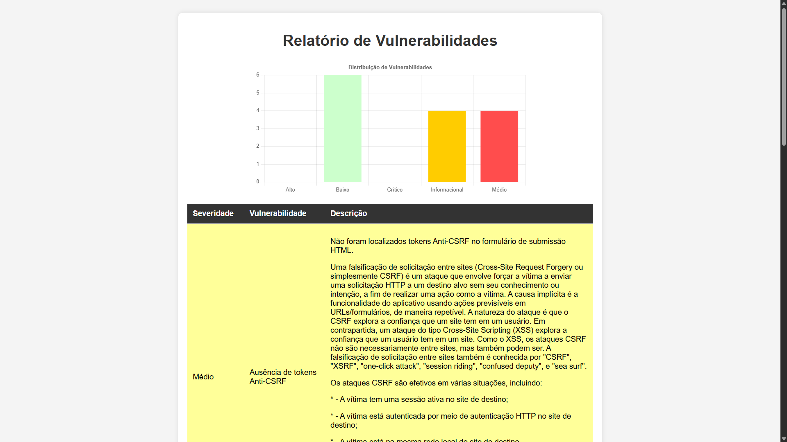

# OWASP ZAP Automator

## 📌 Sobre o Projeto
Este é um script automatizado para executar um **scan de segurança** utilizando o OWASP ZAP. Ele realiza testes de segurança em uma URL fornecida, gera um relatório JSON e converte os resultados em um relatório HTML com gráficos e tabelas.

## 🛠 Tecnologias Utilizadas
- **OWASP ZAP** (Automated Security Scanning)
- **Python** (Subprocess, JSON, Jinja2 para templates)
- **HTML + CSS + JavaScript** (Frontend do relatório)
- **Chart.js** (Gráficos no relatório)

## 📸 Exemplo do Relatório


## 🚀 Como Instalar e Usar

### 🔹 1. Pré-requisitos
- **Python 3+** instalado
- **OWASP ZAP** instalado e acessível via `java -jar`
- Dependências Python:
  ```sh
  pip install jinja2
  ```

### 🔹 2. Configuração
Edite o caminho do ZAP no arquivo `zap_automator.py` para corresponder à sua instalação:
```python
ZAP_PATH = r"C:\Program Files\ZAP\Zed Attack Proxy\zap-2.16.0.jar"
```

### 🔹 3. Executando o Scan
Execute o script passando a URL alvo:
```sh
python zap_automator.py -u http://exemplo.com
```

### 🔹 4. Relatórios Gerados
- `reports/report.json`: Saída bruta do OWASP ZAP
- `reports/report.html`: Relatório visual interativo

## 📝 Personalização
Se quiser alterar o template do relatório, edite o arquivo `templates/report_template.html`.

## 📜 Licença
Projeto livre para uso e modificação.

---
📌 **Desenvolvido por [Davi Soares]**
